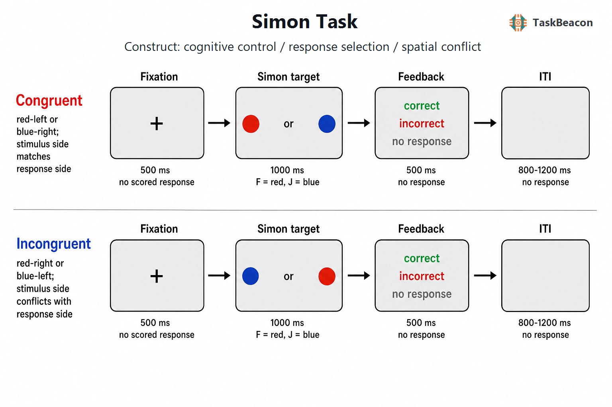

# Simon 任务：空间—反应冲突、认知控制及其测量边界

目标导向行为要求个体依据任务相关信息选择反应，同时限制无关信息对行动的影响。Simon 任务（Simon task）以刺激位置与反应位置之间的非任务相关对应关系构造冲突：即使刺激位置不决定正确反应，位置与反应同侧时的反应通常仍快于、且准确于异侧条件。这一差异称为 Simon 效应。该范式将任务相关属性的规则性选择与位置诱发的反应倾向置于同一试次，因而适合研究刺激—反应转换、选择性干扰控制及其时间进程。其简洁性也带来解释风险：条件差值并非“抑制能力”的无杂质指标，序列学习、特征重复、速度—准确权衡和一般反应速度均可能改变效应量。以下综述据此讨论范式起源、操作逻辑、行为与神经证据、主要应用及测量边界，并简述 TaskBeacon 的当前实现。

## 1. 范式提出与理论背景

Simon 与 Rudell（1967）最初要求参与者依据从左耳或右耳呈现的“左/右”词义作键反应，发现无关的声音来源与要求反应同侧时反应更快。随后，Simon（1969）用视觉刺激进一步表明，即使位置与任务规则无关，个体仍倾向于朝刺激来源方向反应。后来的标准视觉版本通常令颜色、形状或符号决定左/右反应，而刺激随机出现在左、右位置；由此可在感觉输入和运动输出不变的条件下比较空间对应与不对应试次。

维度重叠模型将该效应归因于刺激位置维度与反应位置维度的表征重叠：无关位置会自动激活空间上对应的反应，而任务相关属性经受控通路确定规则要求的反应（Kornblum et al., 1990）。对应试次中两条通路趋于同一反应；不对应试次中，位置激活与规则反应竞争，增加选择时间和错误概率。反应时分布研究进一步指出，Simon 效应常随较慢反应而减小，符合早期位置激活随时间衰减并受到选择性抑制的解释；这种激活—抑制关系依赖任务参数，不能简化为恒定的抑制过程（Ridderinkhof, 2002）。

## 2. 任务逻辑、流程与核心指标

标准试次先呈现注视点，继而在左侧或右侧呈现目标。参与者仅依据目标的非空间属性作左键或右键反应。例如，红色映射左键、蓝色映射右键时，红色出现在左侧和蓝色出现在右侧属于对应条件，另两种组合属于不对应条件。目标可持续到反应发生或预设截止时间；错误、遗漏及反应时被记录，部分版本在试次后呈现正确性反馈。固定或抖动的试次间隔用于控制时间预期。条件通常在区块内随机或伪随机出现，并应平衡目标属性、位置和正确反应侧。

主要因变量是正确试次反应时的 Simon 效应，即“不对应减对应”的条件差，以及相同方向的错误率差。平均差值概括群体层面的干扰成本，但会掩盖效应的时间进程。按反应时分位数绘制 delta plot，可检验效应随反应速度的变化；条件准确率、反应时分布和遗漏率则用于判断速度—准确权衡。序列分析常计算一致性序列效应（congruency sequence effect, CSE）：前一试次不对应后，当前试次的 Simon 效应往往小于前一试次对应后。该交互可与控制调整相符，但刺激、反应和位置特征的重复或交替也会产生相似模式（Kerns, 2006; De Cesarei et al., 2023）。因此，若研究目标涉及试次间适应，应排除完全重复与完全交替等特征绑定条件，并控制局部条件概率。

参数选择会改变效应所代表的加工阶段。较短反应截止时间可能增加遗漏和快速错误，使条件差更偏向早期反应激活；较长窗口则纳入更多已经发生激活衰减或纠正的慢反应。对应试次比例高时，空间对应关系更具预测性，参与者可能学习无关位置—反应关联；不同比例条件因此不能仅按刺激材料相同而直接合并。反应装置的位置应与概念上的左、右反应相符，因为按键的解剖侧、外部空间位置和效应器身份可形成不同的空间编码。练习、区块顺序和试次后反馈也会改变策略与序列依赖。规范报告除条件均值外，还应给出剔除规则、每条件有效试次数、错误率、截止时间、映射是否平衡及条件序列生成方法；这些信息决定 Simon 差值能否在研究间比较（Ridderinkhof, 2002; Gupta et al., 2022）。

Simon 任务测量的是任务相关规则与空间反应倾向发生竞争时的表现。目标出现至按键的阶段同时包含知觉编码、规则检索、反应激活和选择；不对应减对应对比主要定位于反应选择冲突，但并非全球性反应停止。反馈阶段还可能引入错误监测、强化学习和下一试次准备。将整个条件差直接命名为一般“抑制控制”会超出操作所支持的范围。

## 3. 主要行为与神经科学发现

### 3.1 自动反应激活、选择性抑制与情境调整

行为证据较一致地支持无关空间位置能够快速影响反应选择。事件相关电位（event-related potential, ERP）研究利用偏侧化准备电位（lateralized readiness potential, LRP）观察到不对应试次中的早期错误侧运动激活，以及随后向正确反应侧的转换；效应受前一试次对应关系调节，说明位置激活与控制状态均具有动态性（Stürmer et al., 2002）。瞳孔扩张在不对应试次中增加，并与行为干扰相关，但瞳孔同时受唤醒、努力和光反射影响，因而只能作为冲突负荷的辅助指标（van Steenbergen & Band, 2013）。

序列效应的理论归属仍存在异质性。冲突监测解释认为，不对应试次提高控制需求，从而减弱后续干扰；情节提取与关联学习解释则强调，当前刺激会检索既往刺激—反应绑定，且局部概率可改变位置—反应联系。新近研究发现，刺激或反应情境改变会削弱 CSE，长期的切换概率学习也参与该效应（De Cesarei et al., 2023）。奖励同样能够重塑无关位置—反应关联：对不对应条件给予选择性奖励可减小 Simon 效应，表明条件差对学习史和动机性操控敏感（Mittelstädt et al., 2023）。这些结果支持控制的情境依赖性，但不足以将 CSE 唯一归因于冲突触发的在线调节。

### 3.2 fMRI 与 EEG 所揭示的空间和时间进程

功能磁共振成像（functional magnetic resonance imaging, fMRI）显示，不对应相对于对应试次招募前扣带、辅助运动、额顶控制区域及纹状体等分布式系统；Simon 与 Stroop 干扰在这些区域存在相当程度的重叠（Peterson et al., 2002）。试次间分析发现，前扣带与前额叶活动随冲突及后续调整而变化，但同一研究亦指出特征整合可以解释部分行为序列效应（Kerns, 2006）。结合反应时分布指标的研究进一步发现，尾状核活动与更有效的选择性干扰抑制相关，支持额—纹状体系统参与反应竞争的解决（Schmidt et al., 2020）。这些 BOLD 差异说明相关网络在条件对比中的参与，不能单独证明特定脑区对控制过程具有因果作用。

EEG 证据补充了毫秒级时间信息。除 LRP 所反映的早期反应激活外，Simon 型到达任务可分离与冲突检测和跨试次适应相关的两类额中线 theta 活动（Töllner et al., 2017）。源定位与连接分析还显示，内侧前额叶/前扣带 theta 与顶叶、感觉和运动区域之间的相干性在空间冲突中增强（Myers et al., 2021）。因此，theta 更适合解释控制需求下的网络协调时间进程，而非作为单一认知成分或单一解剖来源的特异标志。

## 4. 范式发展与主要应用

范式发展主要沿参数扩展、发展研究和临床研究展开。视觉、触觉线索以及上肢、下肢反应均可产生 Simon 效应，但总体速度和效应幅度随输入—输出模态改变，跨研究比较需保持刺激显著性与反应装置一致（Gupta et al., 2022）。大规模在线横断研究显示，Simon、Stroop 和 flanker 一致性效应在 10—80 岁范围呈现不同的发展轨迹，说明这些任务不宜被视为同一控制能力的可互换测量（Erb et al., 2023）。

在临床研究中，Simon 范式常用于检验额—基底节功能相关的选择性干扰控制。帕金森病样本在行为干扰并未明显异常时仍可表现额中线 theta 减弱，提示神经指标可能比平均反应时差更敏感（Singh et al., 2018）。该结果尚不足以把 Simon 指标用作个体诊断或疾病特异性生物标志；药物状态、运动迟缓、年龄和一般反应速度均需控制。近期基于连续运动轨迹、强化学习和计算模型的扩展，尝试将早期错误激活、后期修正及规则学习分解为不同参数，但其解释依赖具体模型假设，不能由传统平均差值直接推出。

## 5. 测量效度、信度与解释边界

Simon 效应具有稳定的群体均值，但群体效应的可重复性不等于个体排序的可靠性。跨会话研究发现，单一条件的平均反应时通常比“不对应减对应”的差值更可靠，Simon 干扰差值的重测信度至多为中等（Paap & Sawi, 2016）。这一现象符合“信度悖论”：实验任务通过减少个体内噪声获得稳健的平均效应，同时也压缩了真实个体差异，导致差值分数难以稳定排序（Hedge et al., 2018）。短版 Simon 任务能够在较少试次中重现群体效应，且曾报告较好的内部一致性，但这不保证差值分数在不同日期或不同人群中的稳定性（Cevada et al., 2019）。最新分析表明，聚焦冲突更强的快速反应及前一试次对应条件可提高差值信度，代价是改变了估计对象并减少有效试次数（Moretti et al., 2026）。

研究设计应预先区分群体操控检验与个体差异测量。前者可报告反应时和错误率的条件效应及其分布；后者还需报告重测或分层模型信度，并控制一般速度。缺少中性位置条件时，“不对应减对应”无法区分不对应条件的干扰与对应条件的促进。固定颜色—按键映射可能把颜色偏好或优势手差异带入条件均值，宜在参与者间平衡映射。连续正确性反馈会改变错误监测和跨试次学习，因而与无反馈版本的 CSE 不完全等价。临床或发展组的效应差异还可能源于基线速度、错误策略、视觉运动能力和理解程度；仅凭 Simon 差值不宜推断一般执行功能缺陷或神经机制异常。

## 6. TaskBeacon 中的任务实现

### 6.1 任务资源与访问入口

| 资源 | ID | 用途 | 地址 |
|---|---|---|---|
| 完整任务源码 | T000011 | PsychoPy 行为/EEG 实验实现 | [GitHub](https://github.com/TaskBeacon/T000011-simon) |
| 浏览器预览源码 | H000011 | `psyflow-web` 行为型 HTML 原型，不含 EEG 采集 | [GitHub](https://github.com/TaskBeacon/H000011-simon) |

T000011 的清单将采集类型标记为 EEG，当前版本包含试次事件标记及行为数据保存。H000011 的公开清单将其标记为 `behavior`、`html` 和 `prototype`；其公开配置当前同样声明 3 个区块、每区块 60 个试次，但浏览器原型不应视为 EEG 采集版本的等价替代。截至本次核验，未发现该 H 仓库可验证的公开部署入口，故不列出未经确认的在线体验地址。

### 6.2 实现流程与关键参数

TaskBeacon 当前版本采用中文指导语，以红、蓝圆形的颜色决定反应，位置为无关维度。红色对应 `f` 左键，蓝色对应 `j` 右键；红左与蓝右为对应条件，红右与蓝左为不对应条件。全程共 180 个试次，分为 3 个区块，每区块 60 个试次；四种颜色—位置组合由区块条件生成器安排。主要记录包括条件、颜色、位置、正确按键、实际反应、正确性与反应时。该实现没有自适应控制器，也未设置中性条件；区块结束时反馈该区块正确率。

**图 1. TaskBeacon Simon 任务的单试次流程。** 每个试次依次包含 500 ms 中央注视、最长 1000 ms 的侧向彩色圆形及按键窗口、500 ms 正确/错误/未反应反馈，以及 800—1200 ms 抖动空屏间隔。红色要求按 `f` 左键，蓝色要求按 `j` 右键；刺激侧与正确反应侧一致构成对应试次，二者相反构成不对应试次。目标阶段按键后立即终止，超时记为未反应；正确性由颜色—按键规则判定。任务不使用阶梯或其他自适应规则，区块层面仅汇总正确率。

## 参考文献

Cevada, T., Conde, E., Marques, D., & Deslandes, A. C. (2019). Test-retest reliability of the Simon task: A short version proposal. *Somatosensory & Motor Research, 36*(4), 275–282. https://doi.org/10.1080/08990220.2019.1689114

De Cesarei, A., D’Ascenzo, S., Nicoletti, R., & Codispoti, M. (2023). Novelty and learning in cognitive control: Evidence from the Simon task. *Psychological Research, 87*(8), 2390–2406. https://doi.org/10.1007/s00426-023-01813-z

Erb, C. D., Germine, L., & Hartshorne, J. K. (2023). Cognitive control across the lifespan: Congruency effects reveal divergent developmental trajectories. *Journal of Experimental Psychology: General, 152*(11), 3285–3291. https://doi.org/10.1037/xge0001429

Gupta, A., Edwards, H. M., III, Rodriguez, A. R., McKindles, R. J., & Stirling, L. A. (2022). Alternative cue and response modalities maintain the Simon effect but impact task performance. *Applied Ergonomics, 100*, 103648. https://doi.org/10.1016/j.apergo.2021.103648

Hedge, C., Powell, G., & Sumner, P. (2018). The reliability paradox: Why robust cognitive tasks do not produce reliable individual differences. *Behavior Research Methods, 50*(3), 1166–1186. https://doi.org/10.3758/s13428-017-0935-1

Kerns, J. G. (2006). Anterior cingulate and prefrontal cortex activity in an fMRI study of trial-to-trial adjustments on the Simon task. *NeuroImage, 33*(1), 399–405. https://doi.org/10.1016/j.neuroimage.2006.06.012

Kornblum, S., Hasbroucq, T., & Osman, A. (1990). Dimensional overlap: Cognitive basis for stimulus-response compatibility—A model and taxonomy. *Psychological Review, 97*(2), 253–270. https://doi.org/10.1037/0033-295X.97.2.253

Mittelstädt, V., Ulrich, R., König, J., Hofbauer, K., & Mackenzie, I. G. (2023). The influence of reward in the Simon task: Differences and similarities to the Stroop and Eriksen flanker tasks. *Attention, Perception, & Psychophysics, 85*(3), 949–959. https://doi.org/10.3758/s13414-022-02563-7

Moretti, L., Koch, I., Hornjak, R., & von Bastian, C. C. (2026). Quality over quantity: Focusing on high-conflict trials to improve the reliability and validity of attentional control measures. *Journal of Experimental Psychology: Learning, Memory, and Cognition, 52*(1), 34–54. https://doi.org/10.1037/xlm0001466

Myers, J. C., Chinn, L. K., Sur, S., & Golob, E. J. (2021). Widespread theta coherence during spatial cognitive control. *Neuropsychologia, 160*, 107979. https://doi.org/10.1016/j.neuropsychologia.2021.107979

Paap, K. R., & Sawi, O. (2016). The role of test-retest reliability in measuring individual and group differences in executive functioning. *Journal of Neuroscience Methods, 274*, 81–93. https://doi.org/10.1016/j.jneumeth.2016.10.002

Peterson, B. S., Kane, M. J., Alexander, G. M., Lacadie, C., Skudlarski, P., Leung, H.-C., May, J., & Gore, J. C. (2002). An event-related functional MRI study comparing interference effects in the Simon and Stroop tasks. *Cognitive Brain Research, 13*(3), 427–440. https://doi.org/10.1016/S0926-6410(02)00054-X

Ridderinkhof, K. R. (2002). Micro- and macro-adjustments of task set: Activation and suppression in conflict tasks. *Psychological Research, 66*(4), 312–323. https://doi.org/10.1007/s00426-002-0104-7

Schmidt, C. C., Timpert, D. C., Arend, I., Vossel, S., Fink, G. R., Henik, A., & Weiss, P. H. (2020). Control of response interference: Caudate nucleus contributes to selective inhibition. *Scientific Reports, 10*(1), 20977. https://doi.org/10.1038/s41598-020-77744-1

Simon, J. R. (1969). Reactions toward the source of stimulation. *Journal of Experimental Psychology, 81*(1), 174–176. https://doi.org/10.1037/h0027448

Simon, J. R., & Rudell, A. P. (1967). Auditory S-R compatibility: The effect of an irrelevant cue on information processing. *Journal of Applied Psychology, 51*(3), 300–304. https://doi.org/10.1037/h0020586

Singh, A., Richardson, S. P., Narayanan, N., & Cavanagh, J. F. (2018). Mid-frontal theta activity is diminished during cognitive control in Parkinson's disease. *Neuropsychologia, 117*, 113–122. https://doi.org/10.1016/j.neuropsychologia.2018.05.020

Stürmer, B., Leuthold, H., Soetens, E., Schröter, H., & Sommer, W. (2002). Control over location-based response activation in the Simon task: Behavioral and electrophysiological evidence. *Journal of Experimental Psychology: Human Perception and Performance, 28*(6), 1345–1363. https://doi.org/10.1037/0096-1523.28.6.1345

Töllner, T., Wang, Y., Makeig, S., Müller, H. J., Jung, T.-P., & Gramann, K. (2017). Two independent frontal midline theta oscillations during conflict detection and adaptation in a Simon-type manual reaching task. *The Journal of Neuroscience, 37*(9), 2504–2515. https://doi.org/10.1523/JNEUROSCI.1752-16.2017

van Steenbergen, H., & Band, G. P. H. (2013). Pupil dilation in the Simon task as a marker of conflict processing. *Frontiers in Human Neuroscience, 7*, 215. https://doi.org/10.3389/fnhum.2013.00215
